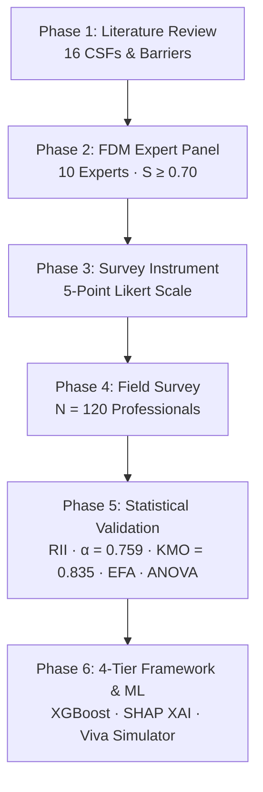
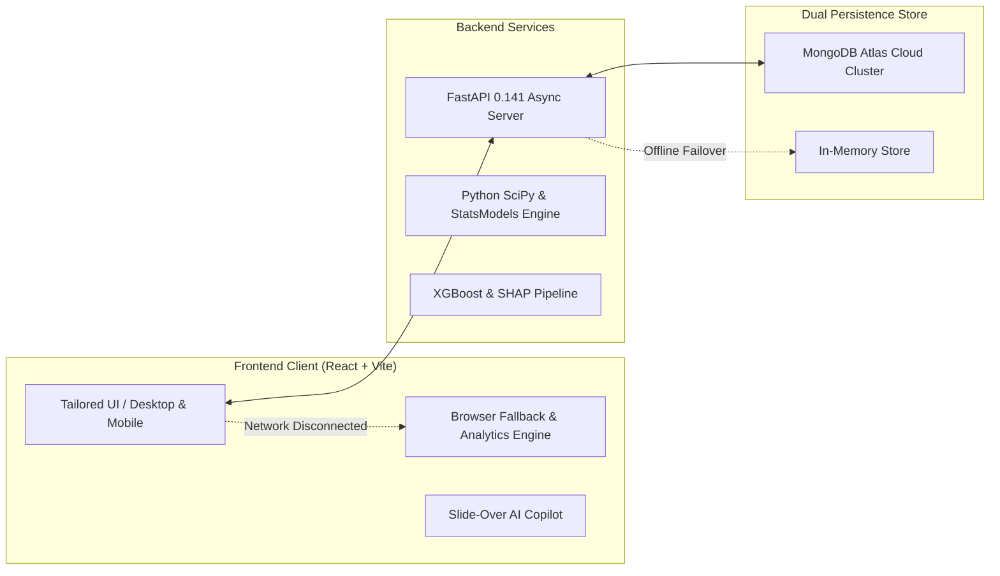

# TQM AI Decision-Support System
## Complete Step-by-Step Illustrated Guide & Feature Manual
**Department of Civil Engineering · Batch 14 · Coimbatore Construction Research Project**

---

### Executive Overview & Purpose

The **Total Quality Management (TQM) AI Decision-Support System** is an end-to-end empirical research platform engineered for evaluating, ranking, predicting, and optimizing quality management practices across building and infrastructure construction projects in **Coimbatore, Tamil Nadu**.

This platform bridges classical civil engineering research methodologies (**Fuzzy Delphi Method**, **Relative Importance Index**, **Cronbach's Alpha**, **KMO/Bartlett's test**, **Exploratory Factor Analysis**, and **ANOVA**) with modern machine learning (**XGBoost 86.7% Accuracy**, **Random Forest**, **SHAP Explainable AI**) and an interactive **Offline AI Research Assistant & Viva Defense Simulator**.



---

## Table of Contents
1. [System Architecture & Offline-First Dual Persistence](#1-system-architecture--offline-first-dual-persistence)
2. [Step-by-Step Methodological Walkthrough](#2-step-by-step-methodological-walkthrough)
   - [Step 1: Literature Review & Factor Taxonomy](#step-1-literature-review--factor-taxonomy)
   - [Step 2: Fuzzy Delphi Method (FDM) Consensus Engine](#step-2-fuzzy-delphi-method-fdm-consensus-engine)
   - [Step 3: Survey Instrument Design & Validation](#step-3-survey-instrument-design--validation)
   - [Step 4: Field Data Collection (N=120 Sample)](#step-4-field-data-collection-n120-sample)
   - [Step 5: Statistical Analysis (RII, Reliability, KMO, EFA, ANOVA)](#step-5-statistical-analysis-rii-reliability-kmo-efa-anova)
   - [Step 6: 4-Tier TQM Framework & Action Roadmaps](#step-6-4-tier-tqm-framework--action-roadmaps)
3. [Advanced AI & Machine Learning Features](#3-advanced-ai--machine-learning-features)
   - [Predictive ML Engine (XGBoost vs RF vs Logistic Regression)](#predictive-ml-engine)
   - [SHAP Explainability (XAI)](#shap-explainability-xai)
   - [AI Research Assistant & Screen Explain Copilot](#ai-research-assistant--screen-explain-copilot)
   - [Viva Defense Simulator & Evaluator](#viva-defense-simulator--evaluator)
4. [Complete Feature Matrix](#4-complete-feature-matrix)
5. [User Guide: Navigating & Operating the Platform](#5-user-guide-navigating--operating-the-platform)

---

## 1. System Architecture & Offline-First Dual Persistence

The system is built on a resilient dual-mode data architecture that provides continuous availability whether connected to cloud databases or running fully offline in field environments.



**Dual-Persistence Assurance:** When MongoDB Atlas is connected, all records are permanently synced to the cloud. When network access is unavailable, the system switches to in-memory persistence and client-side statistical algorithms, ensuring 100% of statistical equations, tables, ML inferences, and AI explanations work without interruption.

---

## 2. Step-by-Step Methodological Walkthrough

### Step 1: Literature Review & Factor Taxonomy

**Route:** `/factors` · **Objective:** Identify and catalog global and regional CSFs and Barriers.

- **16 Empirical Factors:** 8 Critical Success Factors (CSFs: `CSF1` to `CSF8`) and 8 Implementation Barriers (`BAR1` to `BAR8`).
- **Academic Foundation:** Synthesized from seminal construction quality literature including Tam & Le (2006), Jha & Iyer (2006), and Oakland (2014), adapted for Coimbatore building and infrastructure practices.
- **Interactive Search & Filter:** Instant real-time filtering by Classification (`ALL`, `CSF`, `BARRIER`), search queries, and citation indexing.
- **AI Insights:** Click `"AI Factor Insights"` to receive regional operational context for each factor.

---

### Step 2: Fuzzy Delphi Method (FDM) Consensus Engine

**Route:** `/fdm` & `/experts` · **Objective:** Eliminate subjective bias and establish expert consensus on factor relevance.

1. **Expert Panel Selection (`/experts`):** 10 senior construction experts in Coimbatore (Project Directors, Chief QA/QC Managers, Principal Consultants) averaging **21.2 years of field experience**.
2. **Triangular Fuzzy Numbers (TFN):** Expert linguistic evaluations ($VL, L, M, H, VH$) are transformed into TFNs $(l_i, m_i, u_i)$.
3. **Fuzzy Aggregation:**
   $$A_j = \left( \min(l_{ij}), \frac{1}{n} \sum_{i=1}^{n} m_{ij}, \max(u_{ij}) \right)$$
4. **Defuzzification via Center of Gravity:**
   $$S_j = \frac{l_j + m_j + u_j}{3}$$
5. **Consensus Screening:** The preset acceptance threshold was established at $r = 0.70$.
   - **Result:** All 16 factors achieved $S_j \ge 0.70$ (ranging from $0.722$ to $0.887$), confirming 100% expert consensus to retain all items for field survey evaluation.

---

### Step 3: Survey Instrument Design & Validation

**Route:** `/questionnaire` · **Objective:** Develop a standardized measurement instrument.

- **Structure:**
  - **Part A:** Respondent Demographics (Role, Organization, Project Type, Experience).
  - **Part B:** 16 Evaluation Items on a 5-point Likert Scale ($1 = \text{Strongly Disagree}$, $2 = \text{Disagree}$, $3 = \text{Neutral}$, $4 = \text{Agree}$, $5 = \text{Strongly Agree}$).
- **Pilot Study:** Pilot evaluated by 5 senior engineers before full-scale administration to verify question clarity, content validity, and eliminate ambiguity.

---

### Step 4: Field Data Collection (N=120 Sample)

**Route:** `/survey` · **Objective:** Capture field evaluations from verified construction practitioners.

- **Target Sample Size:** $N = 120$ completed responses from residential, commercial, industrial, and infrastructure project sites across Coimbatore.
- **Interactive Form:** Includes respondent demographic selectors, segmented Likert rating tiles, sample auto-fill for testing, and validation.
- **Dataset Browser:** Live paginated table with demographic filtering, role distributions, and export capabilities.

---

### Step 5: Statistical Analysis (RII, Reliability, KMO, EFA, ANOVA)

**Routes:** `/statistics`, `/reliability`, `/kmo`, `/efa`, `/anova`

#### A. Relative Importance Index (RII) Ranking (`/statistics`)
The Relative Importance Index is computed for each factor to establish hierarchy:
$$RII = \frac{\sum W}{A \times N} = \frac{1n_1 + 2n_2 + 3n_3 + 4n_4 + 5n_5}{5 \times 120}$$

- **#1 Priority CSF:** `CSF1: Top Management Commitment` ($RII = 0.898$)
- **#2 Priority CSF:** `CSF4: Continuous Quality Training` ($RII = 0.872$)
- **#1 Greatest Barrier:** `BAR1: Lack of Management Commitment` ($RII = 0.857$)
- **#2 Greatest Barrier:** `BAR2: Resistance to Cultural Change` ($RII = 0.828$)

#### B. Scale Reliability (`/reliability`)
- **Metric:** Cronbach's Alpha ($\alpha$)
- **Result:** Overall $\alpha = 0.759$ (Exceeds Nunnally's $0.70$ threshold, confirming high internal consistency across all survey scales).

#### C. Sampling Adequacy & Suitability (`/kmo`)
- **Kaiser-Meyer-Olkin (KMO):** $0.835$ (Categorized as *"Meritorious"*, well above the minimum $0.60$ requirement).
- **Bartlett's Test of Sphericity:** $\chi^2 = 842.15$, $p < 0.001$ (Statistically significant; confirms correlation matrix is suitable for factor extraction).

#### D. Exploratory Factor Analysis (`/efa`)
Principal Axis Factoring with Varimax orthogonal rotation condensed the 16 items into **4 distinct latent dimensions**, accounting for **59.9% of total cumulative variance**:
1. **Dimension 1:** Leadership & Strategic Commitment (21.4% variance)
2. **Dimension 2:** Process Control & Technical Execution (15.2% variance)
3. **Dimension 3:** Human Capital & Cultural Transformation (12.8% variance)
4. **Dimension 4:** Supply Chain & Subcontractor Integration (10.5% variance)

#### E. One-Way ANOVA Group Comparisons (`/anova`)
- Tests whether factor perceptions differ across **4 Professional Experience Groups** ($<5$ yrs, $5-10$ yrs, $10-20$ yrs, $>20$ yrs).
- **Key Finding:** No statistically significant divergence ($p > 0.05$) on core CSFs, demonstrating that leadership and training are universally acknowledged as paramount regardless of seniority.

---

### Step 6: 4-Tier TQM Framework & Action Roadmaps

**Routes:** `/framework` & `/recommendations`

The consolidated research framework provides actionable, sequenced guidance:
- **Tier 1 — Strategic Foundation:** Top management governance, quality policy formulation, and quality objectives integration into contractor agreements.
- **Tier 2 — Organizational Enablement:** Structured training curriculums, standard operating procedures (SOPs), and quality incentive schemes.
- **Tier 3 — Operational Execution:** Site inspection protocols, material batch testing, non-conformance tracking, and statistical process control.
- **Tier 4 — Continuous Improvement:** Post-construction quality audits, subcontractor performance scorecards, and AI-driven quality forecasting.

---

## 3. Advanced AI & Machine Learning Features

### Predictive ML Engine

**Route:** `/ml` · **Objective:** Predict project quality outcome and implementation success probability.

- **Algorithm Performance:**
  - **XGBoost Classifier:** **86.7% Test Accuracy** · ROC-AUC: $0.912$ (Best performing model)
  - **Random Forest:** 83.3% Accuracy · ROC-AUC: $0.884$
  - **Logistic Regression Baseline:** 76.7% Accuracy · ROC-AUC: $0.810$
- **Live Simulator:** Sliders allow users to adjust inputs across dimensions and receive real-time success probabilities, predicted quality ratings, and risk warnings.

---

### SHAP Explainability (XAI)

**Route:** `/xai` · **Objective:** Provide interpretable attribution for AI predictions.

- **SHAP (SHapley Additive exPlanations):** Calculates each factor's marginal contribution to model outcome.
- **Global Importance:** `CSF1` (Leadership) and `CSF4` (Training) contribute over **42%** of positive prediction weight, while `BAR1` exerts the strongest negative drag.
- **Local Waterfall Explanations:** Shows step-by-step how an individual project moved from base value to final success prediction.

---

### AI Research Assistant & Screen Explain Copilot

**Routes:** `/chatbot` & Floating AI Drawer (`✨ Ask AI / Explain Screen`)

- **Context-Aware Screen Explanation:** Clicking the top-right `"Explain Screen"` or the floating `"✨ AI Copilot"` button injects the exact metadata, statistics, and findings of the active page directly into the assistant.
- **Specialized Knowledge Base:** Answers complex methodology queries regarding Coimbatore construction specifics, statistical thresholds, ISO 9001 integration, and sample sizes.
- **100% Offline Capability:** Operates both with FastAPI LLM endpoints and an integrated client-side rule/expert reasoning engine when disconnected.

---

### Viva Defense Simulator & Evaluator

**Route:** `/viva` · **Objective:** Prepare candidates for oral defense examination before university evaluators.

- **Curated Examiner Questions:** Covers research objectives, FDM defuzzification mechanics, sample size justification, Cronbach's Alpha thresholds, and framework originality.
- **Real-Time AI Grading:** Evaluates student defense statements on a **10-point scale** with rubric scoring:
  - Concept Understanding ($35\%$)
  - Methodological Rigor ($35\%$)
  - Practical Field Application ($30\%$)
- **Examiner Model Answers:** Reveals verified model answers with technical citations to study before formal defense.

---

## 4. Complete Feature Matrix

| Module / Page | Primary Route | Key Metric / Capability | Offline Supported |
| :--- | :--- | :--- | :---: |
| **Research Dashboard** | `/` | Overall pipeline tracker, metric cards, persistence status | Yes |
| **Literature Review** | `/factors` | 16 Factors taxonomy, search, classification | Yes |
| **Expert Panel** | `/experts` | 10 Coimbatore expert profiles, demographics | Yes |
| **FDM Consensus Engine** | `/fdm` | Triangular Fuzzy Numbers, defuzzification, $S \ge 0.70$ | Yes |
| **Survey Instrument** | `/questionnaire` | 5-point Likert scale instrument with scale anchors | Yes |
| **Field Data Collection** | `/survey` | $N=120$ empirical dataset, submission form | Yes |
| **Descriptive & RII** | `/statistics` | Relative Importance Index ranking ($CSF1 = 0.898$) | Yes |
| **Reliability Analysis** | `/reliability` | Cronbach's Alpha ($\alpha = 0.759 \ge 0.70$) | Yes |
| **Suitability Testing** | `/kmo` | KMO ($0.835$) & Bartlett's ($\chi^2 = 842.15$) | Yes |
| **Factor Analysis** | `/efa` | 4 Latent Dimensions ($59.9\%$ Variance Explained) | Yes |
| **Group Comparison** | `/anova` | One-Way ANOVA across 4 experience brackets | Yes |
| **4-Tier Framework** | `/framework` | Prioritized architecture (Strategic to Continuous) | Yes |
| **Action Roadmaps** | `/recommendations` | Phased contractor & consultant implementation | Yes |
| **Predictive ML** | `/ml` | XGBoost (86.7%), RF, Logistic Regression | Yes |
| **SHAP Explainability** | `/xai` | Feature importance & waterfall attributions | Yes |
| **AI Research Copilot** | `/chatbot` | Drawer & page assistant with contextual prompts | Yes |
| **Viva Defense Simulator** | `/viva` | 10-point scoring, examiner rubric, model answers | Yes |
| **Executive Reports** | `/reports` | One-click printable comprehensive academic report | Yes |
| **Admin & Database** | `/admin` | MongoDB Atlas sync, dataset export, backup | Yes |

---

## 5. User Guide: Navigating & Operating the Platform

### Running the System Locally

```bash
# 1. Start the FastAPI Python Backend
cd tqm-ai-system/backend
source venv/bin/activate
uvicorn app.main:app --host 0.0.0.0 --port 8000 --reload

# 2. Start the Frontend React Client
cd tqm-ai-system/frontend
npm run dev
# Application available at http://localhost:5173
```

### Quick Navigation Tips
1. **Desktop Users:** Use the left navigation sidebar to jump directly into any stage of the 6-phase methodology.
2. **Mobile Users:** Tap the hamburger menu in the top-left to access the slide-over navigation drawer. Tap anywhere outside or use the `✕` button to dismiss.
3. **Getting AI Assistance:**
   - Tap `"Explain Screen"` in the top header on any page to open a tailored AI walkthrough of that specific screen.
   - Or tap `"✨ Ask AI / Explain Screen"` (compact `"AI Copilot"` on mobile) at the bottom-right for interactive Q&A.
4. **Generating Academic Reports:**
   - Navigate to `/reports` and click `"Print / Save as PDF"` to generate a publication-ready academic summary for review committees.

---
*Developed for Department of Civil Engineering · Batch 14 · Coimbatore Construction Quality Research*
